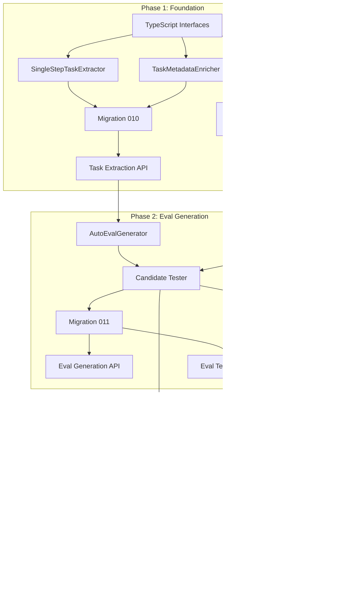

# Phase 1-3 Implementation Plan: Pre-GEPA Foundation

**Date:** 2025-12-09
**Status:** Ready for Implementation
**Scope:** Everything needed before GEPA integration
**Dependencies:** Existing iofold infrastructure (traces, evals, embeddings, sandbox)

---

## Executive Summary

This document provides the complete implementation specification for Phases 1-3 of the GEPA integration. These phases establish:

1. **Phase 1 (Foundation):** DataInst types, task extraction, EvalContext with LLM access
2. **Phase 2 (Eval Generation):** AutoEvalGenerator, candidate testing, pattern analysis
3. **Phase 3 (Human Agreement):** Optimization for human label correlation, winner selection

After completing these phases, the system will be ready for Phase 4: GEPA integration.

---

## Table of Contents

1. [Phase 1: Foundation](#phase-1-foundation)
2. [Phase 2: Eval Generation](#phase-2-eval-generation)
3. [Phase 3: Human Agreement Optimization](#phase-3-human-agreement-optimization)
4. [Database Migrations](#database-migrations)
5. [API Endpoints](#api-endpoints)
6. [Task Dependencies](#task-dependencies)
7. [Testing Strategy](#testing-strategy)

---

## Phase 1: Foundation

### 1.1 TypeScript Interfaces

**File: `src/types/datainst.ts`**

```typescript
/**
 * DataInst - The core data structure for GEPA integration
 * Represents a task that an agent should perform
 */
export interface DataInst {
  /** The task visible to the agent */
  task: Task;

  /** Metadata for evaluation (hidden from agent, visible to eval) */
  task_metadata: TaskMetadata;
}

export interface Task {
  /** The user's message/request (first user message after system prompt) */
  user_message: string;
}

export interface TaskMetadata {
  /** Ground truth - expected correct output (if available) */
  expected_output?: string;

  /** Expected action the agent should take */
  expected_action?: string;

  /** List of criteria for success */
  success_criteria?: string[];

  /** Similar high-rated traces for reference */
  similar_high_rated_traces?: TraceSummary[];

  /** Traces with specific human feedback */
  traces_with_specific_feedback?: TraceFeedbackPair[];

  /** Task categorization */
  task_type?: string;  // "code_generation", "qa", "classification", "extraction"

  /** Estimated difficulty */
  difficulty?: "easy" | "medium" | "hard";

  /** Domain area */
  domain?: string;  // "math", "coding", "support", "creative"

  /** Agent-specific custom fields */
  custom?: Record<string, unknown>;
}

export interface TraceSummary {
  trace_id: string;
  summary: string;          // LLM-generated execution summary
  human_score: number;      // 0-1
  key_behaviors: string[];  // What made this good/bad
}

export interface TraceFeedbackPair {
  trace_id: string;
  human_feedback: string;   // Textual feedback from human
  human_score: number;      // 0-1
}

/**
 * Validation result for task extraction
 */
export interface TaskValidationResult {
  valid: boolean;
  errors: string[];
  warnings: string[];
}
```

**File: `src/types/eval-context.ts`**

```typescript
/**
 * EvalContext - Sandboxed context for eval function execution
 * Provides controlled access to LLM and utilities
 */
export interface EvalContext {
  /** Call an LLM for semantic evaluation */
  call_llm(options: LLMCallOptions): Promise<string>;

  /** Get total cost incurred so far in this eval execution */
  get_cost_so_far(): number;

  /** Get remaining budget for this eval execution */
  get_remaining_budget(): number;

  /** Check if a cache key exists */
  has_cache(key: string): boolean;

  /** Get cached value */
  get_cache(key: string): string | null;

  /** Set cached value (per-execution cache) */
  set_cache(key: string, value: string): void;
}

export interface LLMCallOptions {
  /** The prompt to send */
  prompt: string;

  /** Model to use (default: claude-sonnet-4-5-20250929) */
  model?: "claude-sonnet-4-5-20250929" | "claude-haiku-4-5-20250514" | "gpt-4o-mini";

  /** Temperature (default: 0.0 for determinism) */
  temperature?: number;

  /** Max tokens in response (default: 500) */
  max_tokens?: number;

  /** Optional cache key - if provided, will cache result */
  cache_key?: string;
}

/**
 * Result from eval function execution
 */
export interface EvalResult {
  /** Score from 0 to 1 */
  score: number;  // μ

  /** Feedback string explaining the score */
  feedback: string;  // μ_f

  /** Execution metadata */
  execution: {
    duration_ms: number;
    llm_calls: number;
    llm_cost_usd: number;
    cache_hits: number;
  };
}

/**
 * Configuration for EvalContext
 */
export interface EvalContextConfig {
  /** Maximum budget in USD (default: 0.05) */
  max_budget_usd: number;

  /** Timeout in milliseconds (default: 30000) */
  timeout_ms: number;

  /** Allowed imports beyond safe defaults */
  additional_imports?: string[];
}
```

### 1.2 SingleStepTaskExtractor

**File: `src/services/task-extraction/single-step-extractor.ts`**

```typescript
import { DataInst, Task, TaskMetadata, TaskValidationResult } from '../../types/datainst';
import { Trace, LangGraphExecutionStep } from '../../types/trace';

/**
 * Extracts DataInst from single-step traces
 * A single-step trace has: SystemPrompt → UserMessage → AgentResponse
 */
export class SingleStepTaskExtractor {
  /**
   * Extract a DataInst from a trace
   * Returns null if trace is not single-step
   */
  extractTask(trace: Trace): DataInst | null {
    const validation = this.validate(trace);
    if (!validation.valid) {
      console.warn(`Trace ${trace.id} validation failed:`, validation.errors);
      return null;
    }

    const userMessage = this.findFirstUserMessage(trace.steps);
    if (!userMessage) {
      return null;
    }

    return {
      task: {
        user_message: userMessage
      },
      task_metadata: {}  // Enriched later by TaskMetadataEnricher
    };
  }

  /**
   * Validate that a trace is single-step
   */
  validate(trace: Trace): TaskValidationResult {
    const errors: string[] = [];
    const warnings: string[] = [];

    // Check trace has steps
    if (!trace.steps || trace.steps.length === 0) {
      errors.push('Trace has no execution steps');
      return { valid: false, errors, warnings };
    }

    // Find user messages
    const userMessages = this.findAllUserMessages(trace.steps);

    if (userMessages.length === 0) {
      errors.push('No user message found in trace');
    } else if (userMessages.length > 1) {
      // Multi-turn - not supported yet
      errors.push(`Trace has ${userMessages.length} user messages (multi-turn not supported)`);
    }

    // Check for system prompt
    const hasSystemPrompt = this.findSystemPrompt(trace.steps) !== null;
    if (!hasSystemPrompt) {
      warnings.push('No system prompt found in trace');
    }

    // Check for agent response
    const agentResponse = this.findAgentResponse(trace.steps);
    if (!agentResponse) {
      warnings.push('No agent response found in trace');
    }

    return {
      valid: errors.length === 0,
      errors,
      warnings
    };
  }

  /**
   * Batch extraction with validation stats
   */
  extractBatch(traces: Trace[]): {
    extracted: Array<{ trace: Trace; dataInst: DataInst }>;
    skipped: Array<{ trace: Trace; reason: string }>;
    stats: {
      total: number;
      extracted: number;
      skipped: number;
    };
  } {
    const extracted: Array<{ trace: Trace; dataInst: DataInst }> = [];
    const skipped: Array<{ trace: Trace; reason: string }> = [];

    for (const trace of traces) {
      const dataInst = this.extractTask(trace);
      if (dataInst) {
        extracted.push({ trace, dataInst });
      } else {
        const validation = this.validate(trace);
        skipped.push({
          trace,
          reason: validation.errors.join('; ') || 'Unknown extraction failure'
        });
      }
    }

    return {
      extracted,
      skipped,
      stats: {
        total: traces.length,
        extracted: extracted.length,
        skipped: skipped.length
      }
    };
  }

  // Private helpers

  private findFirstUserMessage(steps: LangGraphExecutionStep[]): string | null {
    for (const step of steps) {
      if (!step.messages_added) continue;
      for (const msg of step.messages_added) {
        if (msg.role === 'user' && msg.content) {
          return typeof msg.content === 'string'
            ? msg.content
            : JSON.stringify(msg.content);
        }
      }
    }
    return null;
  }

  private findAllUserMessages(steps: LangGraphExecutionStep[]): string[] {
    const messages: string[] = [];
    for (const step of steps) {
      if (!step.messages_added) continue;
      for (const msg of step.messages_added) {
        if (msg.role === 'user' && msg.content) {
          messages.push(
            typeof msg.content === 'string'
              ? msg.content
              : JSON.stringify(msg.content)
          );
        }
      }
    }
    return messages;
  }

  private findSystemPrompt(steps: LangGraphExecutionStep[]): string | null {
    for (const step of steps) {
      if (!step.messages_added) continue;
      for (const msg of step.messages_added) {
        if (msg.role === 'system' && msg.content) {
          return typeof msg.content === 'string'
            ? msg.content
            : JSON.stringify(msg.content);
        }
      }
    }
    return null;
  }

  private findAgentResponse(steps: LangGraphExecutionStep[]): string | null {
    // Agent response is typically the last assistant message
    for (let i = steps.length - 1; i >= 0; i--) {
      const step = steps[i];
      if (!step.messages_added) continue;
      for (let j = step.messages_added.length - 1; j >= 0; j--) {
        const msg = step.messages_added[j];
        if (msg.role === 'assistant' && msg.content) {
          return typeof msg.content === 'string'
            ? msg.content
            : JSON.stringify(msg.content);
        }
      }
    }
    return null;
  }
}
```

### 1.3 TaskMetadataEnricher

**File: `src/services/task-extraction/metadata-enricher.ts`**

```typescript
import { DataInst, TaskMetadata, TraceSummary, TraceFeedbackPair } from '../../types/datainst';
import { VectorService } from '../vector-service';
import { TraceService } from '../trace-service';
import { D1Database } from '@cloudflare/workers-types';

export interface EnrichmentOptions {
  /** Whether to find similar high-rated traces */
  enableSimilarTraces?: boolean;

  /** Whether to include traces with feedback */
  enableFeedbackTraces?: boolean;

  /** Whether to categorize the task type */
  enableTaskCategorization?: boolean;

  /** Minimum score for similar traces (default: 0.7) */
  similarTraceMinScore?: number;

  /** Maximum similar traces to include (default: 3) */
  similarTraceLimit?: number;

  /** Maximum feedback traces to include (default: 2) */
  feedbackTraceLimit?: number;
}

/**
 * Enriches DataInst with metadata useful for evaluation
 */
export class TaskMetadataEnricher {
  constructor(
    private db: D1Database,
    private vectorService: VectorService,
    private traceService: TraceService
  ) {}

  /**
   * Enrich a DataInst with additional metadata
   */
  async enrich(
    dataInst: DataInst,
    agentId: string,
    options: EnrichmentOptions = {}
  ): Promise<DataInst> {
    const {
      enableSimilarTraces = true,
      enableFeedbackTraces = true,
      enableTaskCategorization = false,
      similarTraceMinScore = 0.7,
      similarTraceLimit = 3,
      feedbackTraceLimit = 2
    } = options;

    const metadata: TaskMetadata = { ...dataInst.task_metadata };

    // Run enrichments in parallel
    const enrichments = await Promise.all([
      enableSimilarTraces
        ? this.findSimilarHighRatedTraces(
            dataInst.task.user_message,
            agentId,
            similarTraceMinScore,
            similarTraceLimit
          )
        : null,

      enableFeedbackTraces
        ? this.findTracesWithFeedback(
            dataInst.task.user_message,
            agentId,
            feedbackTraceLimit
          )
        : null,

      enableTaskCategorization
        ? this.categorizeTask(dataInst.task.user_message)
        : null
    ]);

    const [similarTraces, feedbackTraces, taskCategory] = enrichments;

    if (similarTraces && similarTraces.length > 0) {
      metadata.similar_high_rated_traces = similarTraces;
    }

    if (feedbackTraces && feedbackTraces.length > 0) {
      metadata.traces_with_specific_feedback = feedbackTraces;
    }

    if (taskCategory) {
      metadata.task_type = taskCategory.type;
      metadata.domain = taskCategory.domain;
      metadata.difficulty = taskCategory.difficulty;
    }

    return {
      ...dataInst,
      task_metadata: metadata
    };
  }

  /**
   * Find similar traces that have high human scores
   */
  private async findSimilarHighRatedTraces(
    userMessage: string,
    agentId: string,
    minScore: number,
    limit: number
  ): Promise<TraceSummary[]> {
    // 1. Get embedding for user message
    const embedding = await this.vectorService.embed(userMessage);

    // 2. Query for similar traces
    const similar = await this.vectorService.query(embedding, {
      topK: limit * 3,  // Get extras to filter by score
      namespace: `agent:${agentId}:task`,
      filter: {
        has_human_score: true
      }
    });

    // 3. Fetch trace details and filter by score
    const traceIds = similar.matches.map(m => m.id);
    const traces = await this.traceService.getTracesByIds(traceIds);

    const highRated = traces
      .filter(t => t.human_score !== undefined && t.human_score >= minScore)
      .slice(0, limit);

    // 4. Generate summaries (from cached or generate)
    const summaries: TraceSummary[] = [];
    for (const trace of highRated) {
      const summary = await this.getOrGenerateTraceSummary(trace);
      summaries.push(summary);
    }

    return summaries;
  }

  /**
   * Find traces that have specific human feedback text
   */
  private async findTracesWithFeedback(
    userMessage: string,
    agentId: string,
    limit: number
  ): Promise<TraceFeedbackPair[]> {
    // Query traces with feedback for this agent
    const result = await this.db.prepare(`
      SELECT
        t.id as trace_id,
        t.human_feedback,
        t.human_score
      FROM traces t
      WHERE t.agent_id = ?
        AND t.human_feedback IS NOT NULL
        AND t.human_feedback != ''
      ORDER BY t.created_at DESC
      LIMIT ?
    `).bind(agentId, limit * 2).all();

    if (!result.results || result.results.length === 0) {
      return [];
    }

    // TODO: Semantic similarity ranking to user message
    // For now, return most recent
    return result.results.slice(0, limit).map(row => ({
      trace_id: row.trace_id as string,
      human_feedback: row.human_feedback as string,
      human_score: row.human_score as number
    }));
  }

  /**
   * Categorize task type using heuristics (LLM-based categorization optional)
   */
  private async categorizeTask(userMessage: string): Promise<{
    type: string;
    domain: string;
    difficulty: "easy" | "medium" | "hard";
  } | null> {
    // Simple heuristic categorization
    const lowered = userMessage.toLowerCase();

    let type = "general";
    if (lowered.includes("code") || lowered.includes("function") || lowered.includes("implement")) {
      type = "code_generation";
    } else if (lowered.includes("?") && lowered.length < 200) {
      type = "qa";
    } else if (lowered.includes("classify") || lowered.includes("categorize")) {
      type = "classification";
    } else if (lowered.includes("extract") || lowered.includes("find all")) {
      type = "extraction";
    } else if (lowered.includes("summarize") || lowered.includes("summary")) {
      type = "summarization";
    }

    let domain = "general";
    if (lowered.match(/\b(python|javascript|typescript|java|code|function|class)\b/)) {
      domain = "coding";
    } else if (lowered.match(/\b(math|calculate|equation|number)\b/)) {
      domain = "math";
    } else if (lowered.match(/\b(help|support|issue|problem)\b/)) {
      domain = "support";
    }

    // Difficulty based on length and complexity
    let difficulty: "easy" | "medium" | "hard" = "medium";
    if (userMessage.length < 50) {
      difficulty = "easy";
    } else if (userMessage.length > 500 || lowered.includes("complex") || lowered.includes("advanced")) {
      difficulty = "hard";
    }

    return { type, domain, difficulty };
  }

  /**
   * Get or generate a trace summary
   */
  private async getOrGenerateTraceSummary(trace: any): Promise<TraceSummary> {
    // Check cache first
    const cached = await this.db.prepare(`
      SELECT summary, key_behaviors FROM trace_summaries WHERE trace_id = ?
    `).bind(trace.id).first();

    if (cached) {
      return {
        trace_id: trace.id,
        summary: cached.summary as string,
        human_score: trace.human_score,
        key_behaviors: JSON.parse(cached.key_behaviors as string || '[]')
      };
    }

    // Generate summary (simplified - real impl would use LLM)
    const summary = this.generateQuickSummary(trace);
    const keyBehaviors = this.extractKeyBehaviors(trace);

    // Cache it
    await this.db.prepare(`
      INSERT INTO trace_summaries (trace_id, summary, key_behaviors, created_at)
      VALUES (?, ?, ?, datetime('now'))
    `).bind(trace.id, summary, JSON.stringify(keyBehaviors)).run();

    return {
      trace_id: trace.id,
      summary,
      human_score: trace.human_score,
      key_behaviors: keyBehaviors
    };
  }

  private generateQuickSummary(trace: any): string {
    const steps = trace.steps || [];
    const toolCalls = steps.flatMap((s: any) => s.tool_calls || []);
    const toolNames = [...new Set(toolCalls.map((tc: any) => tc.tool_name))];

    return `Executed ${steps.length} steps using tools: ${toolNames.join(', ') || 'none'}`;
  }

  private extractKeyBehaviors(trace: any): string[] {
    const behaviors: string[] = [];
    const steps = trace.steps || [];

    if (steps.length === 1) {
      behaviors.push('Single-step execution');
    } else if (steps.length > 5) {
      behaviors.push('Multi-step complex execution');
    }

    const toolCalls = steps.flatMap((s: any) => s.tool_calls || []);
    if (toolCalls.length === 0) {
      behaviors.push('No tool usage');
    } else {
      behaviors.push(`Used ${toolCalls.length} tool calls`);
    }

    return behaviors;
  }
}
```

### 1.4 EvalContext Implementation

**File: `src/services/eval/eval-context.ts`**

```typescript
import { EvalContext, EvalContextConfig, LLMCallOptions } from '../../types/eval-context';
import Anthropic from '@anthropic-ai/sdk';

/**
 * Sandboxed context for eval function execution
 * Provides controlled LLM access with cost tracking and caching
 */
export class EvalContextImpl implements EvalContext {
  private costSoFar: number = 0;
  private llmCallCount: number = 0;
  private cacheHits: number = 0;
  private cache: Map<string, string> = new Map();
  private startTime: number;

  constructor(
    private anthropic: Anthropic,
    private config: EvalContextConfig = {
      max_budget_usd: 0.05,
      timeout_ms: 30000
    }
  ) {
    this.startTime = Date.now();
  }

  /**
   * Call an LLM for semantic evaluation
   */
  async call_llm(options: LLMCallOptions): Promise<string> {
    // Check budget
    if (this.costSoFar >= this.config.max_budget_usd) {
      throw new Error(`Budget exceeded: $${this.costSoFar.toFixed(4)} >= $${this.config.max_budget_usd}`);
    }

    // Check timeout
    if (Date.now() - this.startTime > this.config.timeout_ms) {
      throw new Error(`Timeout exceeded: ${this.config.timeout_ms}ms`);
    }

    // Check cache
    if (options.cache_key && this.cache.has(options.cache_key)) {
      this.cacheHits++;
      return this.cache.get(options.cache_key)!;
    }

    // Call LLM
    const model = options.model || 'claude-sonnet-4-5-20250929';
    const response = await this.anthropic.messages.create({
      model,
      max_tokens: options.max_tokens || 500,
      temperature: options.temperature || 0,
      messages: [{ role: 'user', content: options.prompt }]
    });

    // Track cost (approximate pricing)
    const inputTokens = response.usage.input_tokens;
    const outputTokens = response.usage.output_tokens;
    const cost = this.calculateCost(model, inputTokens, outputTokens);
    this.costSoFar += cost;
    this.llmCallCount++;

    // Extract response text
    const text = response.content[0].type === 'text'
      ? response.content[0].text
      : '';

    // Cache if key provided
    if (options.cache_key) {
      this.cache.set(options.cache_key, text);
    }

    return text;
  }

  get_cost_so_far(): number {
    return this.costSoFar;
  }

  get_remaining_budget(): number {
    return Math.max(0, this.config.max_budget_usd - this.costSoFar);
  }

  has_cache(key: string): boolean {
    return this.cache.has(key);
  }

  get_cache(key: string): string | null {
    return this.cache.get(key) || null;
  }

  set_cache(key: string, value: string): void {
    this.cache.set(key, value);
  }

  /**
   * Get execution statistics
   */
  getStats(): {
    duration_ms: number;
    llm_calls: number;
    llm_cost_usd: number;
    cache_hits: number;
  } {
    return {
      duration_ms: Date.now() - this.startTime,
      llm_calls: this.llmCallCount,
      llm_cost_usd: this.costSoFar,
      cache_hits: this.cacheHits
    };
  }

  /**
   * Calculate approximate cost for LLM call
   */
  private calculateCost(model: string, inputTokens: number, outputTokens: number): number {
    // Pricing per 1M tokens (approximate, as of late 2024)
    const pricing: Record<string, { input: number; output: number }> = {
      'claude-sonnet-4-5-20250929': { input: 3.0, output: 15.0 },
      'claude-haiku-4-5-20250514': { input: 0.25, output: 1.25 },
      'gpt-4o-mini': { input: 0.15, output: 0.60 }
    };

    const price = pricing[model] || pricing['claude-sonnet-4-5-20250929'];
    return (inputTokens * price.input + outputTokens * price.output) / 1_000_000;
  }
}

/**
 * Safe imports available to eval functions
 */
export const SAFE_EVAL_IMPORTS = [
  'json',
  're',
  'typing',
  'math',
  'datetime',
  'difflib'  // For string similarity
] as const;

/**
 * Serialize EvalContext for Python sandbox
 */
export function serializeEvalContextForPython(ctx: EvalContextImpl): string {
  return JSON.stringify({
    cost_so_far: ctx.get_cost_so_far(),
    remaining_budget: ctx.get_remaining_budget(),
    stats: ctx.getStats()
  });
}
```

### 1.5 Updated Eval Runner

**File: `src/services/eval/eval-runner.ts`**

```typescript
import { EvalContextImpl, SAFE_EVAL_IMPORTS } from './eval-context';
import { DataInst, Task, TaskMetadata } from '../../types/datainst';
import { EvalResult } from '../../types/eval-context';
import { PythonRunner } from '../python-runner';
import Anthropic from '@anthropic-ai/sdk';

/**
 * Runs eval functions against traces with the new interface
 */
export class EvalRunner {
  constructor(
    private pythonRunner: PythonRunner,
    private anthropic: Anthropic
  ) {}

  /**
   * Execute an eval function with the new signature
   * eval_function(task, task_metadata, trace, ctx) -> (score, feedback)
   */
  async runEval(
    evalCode: string,
    task: Task,
    taskMetadata: TaskMetadata,
    trace: Record<string, unknown>,
    options: {
      maxBudgetUsd?: number;
      timeoutMs?: number;
    } = {}
  ): Promise<EvalResult> {
    const ctx = new EvalContextImpl(this.anthropic, {
      max_budget_usd: options.maxBudgetUsd || 0.05,
      timeout_ms: options.timeoutMs || 30000
    });

    const startTime = Date.now();

    // Build the Python execution wrapper
    const wrapperCode = this.buildPythonWrapper(evalCode);

    // Prepare inputs
    const inputs = {
      task: task,
      task_metadata: taskMetadata,
      trace: trace
    };

    try {
      // Execute in sandbox with LLM callback bridge
      const result = await this.executeWithLLMBridge(
        wrapperCode,
        inputs,
        ctx,
        options.timeoutMs || 30000
      );

      const stats = ctx.getStats();

      return {
        score: result.score,
        feedback: result.feedback,
        execution: {
          duration_ms: Date.now() - startTime,
          llm_calls: stats.llm_calls,
          llm_cost_usd: stats.llm_cost_usd,
          cache_hits: stats.cache_hits
        }
      };
    } catch (error) {
      return {
        score: 0,
        feedback: `Eval execution failed: ${error instanceof Error ? error.message : 'Unknown error'}`,
        execution: {
          duration_ms: Date.now() - startTime,
          llm_calls: ctx.getStats().llm_calls,
          llm_cost_usd: ctx.getStats().llm_cost_usd,
          cache_hits: ctx.getStats().cache_hits
        }
      };
    }
  }

  /**
   * Build Python wrapper that exposes ctx.call_llm
   */
  private buildPythonWrapper(evalCode: string): string {
    return `
import json
import re
import math
import datetime
import difflib
from typing import Any, Dict, Tuple, Optional

# Context stub - call_llm is bridged from TypeScript
class EvalContext:
    def __init__(self, bridge_fn):
        self._bridge_fn = bridge_fn
        self._cost = 0.0
        self._cache = {}

    def call_llm(
        self,
        prompt: str,
        model: str = "claude-sonnet-4-5-20250929",
        temperature: float = 0.0,
        max_tokens: int = 500,
        cache_key: Optional[str] = None
    ) -> str:
        if cache_key and cache_key in self._cache:
            return self._cache[cache_key]

        result = self._bridge_fn({
            "prompt": prompt,
            "model": model,
            "temperature": temperature,
            "max_tokens": max_tokens,
            "cache_key": cache_key
        })

        if cache_key:
            self._cache[cache_key] = result
        return result

    def get_cost_so_far(self) -> float:
        return self._cost

    def get_remaining_budget(self) -> float:
        return 0.05 - self._cost

# User's eval function
${evalCode}

# Execute and return result
def _execute(task: Dict, task_metadata: Dict, trace: Dict, bridge_fn) -> Dict:
    ctx = EvalContext(bridge_fn)
    try:
        score, feedback = eval_function(task, task_metadata, trace, ctx)
        return {"score": float(score), "feedback": str(feedback), "success": True}
    except Exception as e:
        return {"score": 0.0, "feedback": f"Error: {str(e)}", "success": False}
`;
  }

  /**
   * Execute Python with LLM bridge
   * Uses callback mechanism to handle call_llm from Python
   */
  private async executeWithLLMBridge(
    code: string,
    inputs: {
      task: Task;
      task_metadata: TaskMetadata;
      trace: Record<string, unknown>;
    },
    ctx: EvalContextImpl,
    timeoutMs: number
  ): Promise<{ score: number; feedback: string }> {
    // For initial implementation, we'll serialize LLM calls
    // Future: Could use worker threads for true async bridging

    const pendingLLMCalls: Array<{
      resolve: (value: string) => void;
      reject: (reason: any) => void;
      options: any;
    }> = [];

    // Execute Python with polling for LLM calls
    const result = await this.pythonRunner.executeWithCallback(
      code,
      {
        task: inputs.task,
        task_metadata: inputs.task_metadata,
        trace: inputs.trace
      },
      async (callData: any) => {
        // Handle LLM call from Python
        return await ctx.call_llm({
          prompt: callData.prompt,
          model: callData.model,
          temperature: callData.temperature,
          max_tokens: callData.max_tokens,
          cache_key: callData.cache_key
        });
      },
      timeoutMs
    );

    return {
      score: result.score,
      feedback: result.feedback
    };
  }
}
```

---

## Phase 2: Eval Generation

### 2.1 AutoEvalGenerator

**File: `src/services/eval/auto-eval-generator.ts`**

```typescript
import { DataInst } from '../../types/datainst';
import { EvalRunner } from './eval-runner';
import Anthropic from '@anthropic-ai/sdk';

export interface LabeledTrace {
  trace_id: string;
  task: { user_message: string };
  trace: Record<string, unknown>;
  human_score: number;  // 0-1
  human_feedback?: string;
}

export interface EvalCandidate {
  id: string;
  code: string;
  variation: string;  // "correctness", "efficiency", "safety", "completeness", "ensemble"

  // Set after testing
  agreement_rate?: number;
  confusion_matrix?: {
    true_positive: number;
    true_negative: number;
    false_positive: number;
    false_negative: number;
  };
}

export interface PatternAnalysis {
  positive_patterns: string[];  // What good traces have
  negative_patterns: string[];  // What bad traces have
  key_differentiators: string[];
}

/**
 * Generates candidate eval functions from labeled traces
 */
export class AutoEvalGenerator {
  constructor(
    private anthropic: Anthropic
  ) {}

  /**
   * Generate candidate eval functions
   */
  async generate(
    labeledTraces: LabeledTrace[],
    targetCount: number = 5
  ): Promise<EvalCandidate[]> {
    // Validate minimum traces
    if (labeledTraces.length < 10) {
      throw new Error(`Need at least 10 labeled traces, got ${labeledTraces.length}`);
    }

    // 1. Analyze patterns
    const patterns = await this.analyzePatterns(labeledTraces);

    // 2. Generate candidates with different variations
    const variations = ['correctness', 'efficiency', 'safety', 'completeness', 'ensemble'];
    const candidates: EvalCandidate[] = [];

    for (let i = 0; i < Math.min(targetCount, variations.length); i++) {
      const candidate = await this.generateCandidate(
        patterns,
        variations[i],
        labeledTraces
      );
      candidates.push(candidate);
    }

    // 3. Validate all candidates
    const validCandidates = candidates.filter(c => this.validateCandidate(c));

    return validCandidates;
  }

  /**
   * Analyze patterns in high vs low scored traces
   */
  private async analyzePatterns(labeledTraces: LabeledTrace[]): Promise<PatternAnalysis> {
    const highScored = labeledTraces.filter(t => t.human_score >= 0.7);
    const lowScored = labeledTraces.filter(t => t.human_score <= 0.3);

    const analysisPrompt = `
Analyze these agent executions to understand what distinguishes good from bad responses.

## HIGH-QUALITY EXECUTIONS (score >= 0.7):
${highScored.slice(0, 5).map((t, i) => `
### Example ${i + 1} (score: ${t.human_score})
Task: ${t.task.user_message}
Response: ${JSON.stringify(t.trace).slice(0, 1000)}
${t.human_feedback ? `Human feedback: ${t.human_feedback}` : ''}
`).join('\n')}

## LOW-QUALITY EXECUTIONS (score <= 0.3):
${lowScored.slice(0, 5).map((t, i) => `
### Example ${i + 1} (score: ${t.human_score})
Task: ${t.task.user_message}
Response: ${JSON.stringify(t.trace).slice(0, 1000)}
${t.human_feedback ? `Human feedback: ${t.human_feedback}` : ''}
`).join('\n')}

Identify:
1. POSITIVE PATTERNS: What do high-quality responses consistently have?
2. NEGATIVE PATTERNS: What do low-quality responses consistently have?
3. KEY DIFFERENTIATORS: What's the clearest signal distinguishing good from bad?

Return JSON:
{
  "positive_patterns": ["pattern1", "pattern2", ...],
  "negative_patterns": ["pattern1", "pattern2", ...],
  "key_differentiators": ["differentiator1", "differentiator2", ...]
}
`;

    const response = await this.anthropic.messages.create({
      model: 'claude-sonnet-4-5-20250929',
      max_tokens: 2000,
      temperature: 0,
      messages: [{ role: 'user', content: analysisPrompt }]
    });

    const text = response.content[0].type === 'text' ? response.content[0].text : '';
    const jsonMatch = text.match(/\{[\s\S]*\}/);

    if (!jsonMatch) {
      return {
        positive_patterns: ['Complete response', 'Addresses user request'],
        negative_patterns: ['Incomplete response', 'Off-topic'],
        key_differentiators: ['Completeness', 'Relevance']
      };
    }

    return JSON.parse(jsonMatch[0]);
  }

  /**
   * Generate a single eval candidate with specific variation focus
   */
  private async generateCandidate(
    patterns: PatternAnalysis,
    variation: string,
    labeledTraces: LabeledTrace[]
  ): Promise<EvalCandidate> {
    const variationPrompts: Record<string, string> = {
      correctness: 'Focus on whether the response correctly addresses the task. Check for accuracy and completeness.',
      efficiency: 'Focus on whether the response is concise and efficient. Penalize unnecessary verbosity or steps.',
      safety: 'Focus on whether the response is safe and appropriate. Check for harmful content or mistakes.',
      completeness: 'Focus on whether all aspects of the task are addressed. Check for missing parts.',
      ensemble: 'Balance all aspects: correctness, efficiency, safety, and completeness equally.'
    };

    const genPrompt = `
Generate a Python eval function based on these patterns and focus:

## PATTERNS IDENTIFIED:
Positive: ${patterns.positive_patterns.join(', ')}
Negative: ${patterns.negative_patterns.join(', ')}
Key differentiators: ${patterns.key_differentiators.join(', ')}

## FOCUS: ${variationPrompts[variation]}

## FUNCTION SIGNATURE (MUST match exactly):
\`\`\`python
def eval_function(task: dict, task_metadata: dict, trace: dict, ctx) -> tuple[float, str]:
    """
    Evaluate an agent's execution.

    Args:
        task: {"user_message": "the user's request"}
        task_metadata: {"expected_output": "...", "similar_high_rated_traces": [...], ...}
        trace: {"agent_response": "...", "tool_calls": [...], ...}
        ctx: EvalContext with ctx.call_llm(prompt, model, temperature, max_tokens, cache_key)

    Returns:
        score: float between 0 and 1
        feedback: string explaining the score
    """
    ...
\`\`\`

## REQUIREMENTS:
1. Return tuple of (float 0-1, string feedback)
2. Use ctx.call_llm() for semantic checks (expensive - use sparingly)
3. Use fast heuristics first, LLM only when needed
4. Handle edge cases (empty response, missing fields)
5. Only use safe imports: json, re, typing, math, datetime, difflib

## SAMPLE TRACE STRUCTURE:
${JSON.stringify(labeledTraces[0].trace, null, 2).slice(0, 500)}

Generate the complete function:
`;

    const response = await this.anthropic.messages.create({
      model: 'claude-sonnet-4-5-20250929',
      max_tokens: 3000,
      temperature: 0.3,  // Some creativity for variation
      messages: [{ role: 'user', content: genPrompt }]
    });

    const text = response.content[0].type === 'text' ? response.content[0].text : '';
    const code = this.extractPythonCode(text);

    return {
      id: `candidate_${variation}_${Date.now()}`,
      code,
      variation
    };
  }

  /**
   * Validate candidate eval code
   */
  private validateCandidate(candidate: EvalCandidate): boolean {
    const code = candidate.code;

    // Check function signature exists
    if (!code.includes('def eval_function(')) {
      console.warn(`Candidate ${candidate.id}: Missing eval_function definition`);
      return false;
    }

    // Check returns tuple
    if (!code.includes('return ') || !code.match(/return\s+[\(\[]?[\d\.]+/)) {
      // Might return variable, that's ok
    }

    // Check no forbidden imports
    const forbiddenImports = ['os', 'subprocess', 'sys', 'socket', 'requests', 'urllib'];
    for (const forbidden of forbiddenImports) {
      if (code.includes(`import ${forbidden}`) || code.includes(`from ${forbidden}`)) {
        console.warn(`Candidate ${candidate.id}: Forbidden import ${forbidden}`);
        return false;
      }
    }

    // Check has task/trace access
    if (!code.includes('task') || !code.includes('trace')) {
      console.warn(`Candidate ${candidate.id}: Doesn't use task or trace`);
      return false;
    }

    return true;
  }

  /**
   * Extract Python code from LLM response
   */
  private extractPythonCode(text: string): string {
    // Try to find code block
    const codeBlockMatch = text.match(/```python\n([\s\S]*?)```/);
    if (codeBlockMatch) {
      return codeBlockMatch[1].trim();
    }

    // Try plain code block
    const plainBlockMatch = text.match(/```\n([\s\S]*?)```/);
    if (plainBlockMatch) {
      return plainBlockMatch[1].trim();
    }

    // Look for function definition
    const funcMatch = text.match(/def eval_function[\s\S]*/);
    if (funcMatch) {
      return funcMatch[0].trim();
    }

    return text;
  }
}
```

### 2.2 Candidate Testing Service

**File: `src/services/eval/candidate-tester.ts`**

```typescript
import { EvalCandidate, LabeledTrace } from './auto-eval-generator';
import { EvalRunner } from './eval-runner';

export interface TestResult {
  candidate_id: string;
  agreement_rate: number;  // Correlation with human scores
  accuracy: number;        // Binary accuracy at 0.5 threshold
  cohen_kappa: number;     // Agreement accounting for chance
  precision: number;
  recall: number;
  f1_score: number;
  confusion_matrix: {
    true_positive: number;
    true_negative: number;
    false_positive: number;
    false_negative: number;
  };
  per_trace_results: Array<{
    trace_id: string;
    eval_score: number;
    human_score: number;
    feedback: string;
    error?: string;
  }>;
  execution_stats: {
    total_cost_usd: number;
    avg_duration_ms: number;
    failures: number;
  };
}

/**
 * Tests eval candidates against labeled traces
 */
export class CandidateTester {
  constructor(
    private evalRunner: EvalRunner
  ) {}

  /**
   * Test a candidate against all labeled traces
   */
  async testCandidate(
    candidate: EvalCandidate,
    labeledTraces: LabeledTrace[]
  ): Promise<TestResult> {
    const perTraceResults: TestResult['per_trace_results'] = [];
    let totalCost = 0;
    let totalDuration = 0;
    let failures = 0;

    // Evaluate each trace
    for (const labeled of labeledTraces) {
      try {
        const result = await this.evalRunner.runEval(
          candidate.code,
          labeled.task,
          {}, // task_metadata - empty for testing
          labeled.trace
        );

        perTraceResults.push({
          trace_id: labeled.trace_id,
          eval_score: result.score,
          human_score: labeled.human_score,
          feedback: result.feedback
        });

        totalCost += result.execution.llm_cost_usd;
        totalDuration += result.execution.duration_ms;
      } catch (error) {
        failures++;
        perTraceResults.push({
          trace_id: labeled.trace_id,
          eval_score: 0,
          human_score: labeled.human_score,
          feedback: '',
          error: error instanceof Error ? error.message : 'Unknown error'
        });
      }
    }

    // Calculate metrics
    const evalScores = perTraceResults.map(r => r.eval_score);
    const humanScores = perTraceResults.map(r => r.human_score);

    const agreementRate = this.pearsonCorrelation(evalScores, humanScores);
    const confusionMatrix = this.calculateConfusionMatrix(evalScores, humanScores, 0.5);
    const { accuracy, precision, recall, f1 } = this.calculateClassificationMetrics(confusionMatrix);
    const cohenKappa = this.calculateCohenKappa(confusionMatrix, evalScores.length);

    return {
      candidate_id: candidate.id,
      agreement_rate: agreementRate,
      accuracy,
      cohen_kappa: cohenKappa,
      precision,
      recall,
      f1_score: f1,
      confusion_matrix: confusionMatrix,
      per_trace_results: perTraceResults,
      execution_stats: {
        total_cost_usd: totalCost,
        avg_duration_ms: totalDuration / labeledTraces.length,
        failures
      }
    };
  }

  /**
   * Test multiple candidates and rank them
   */
  async testAndRankCandidates(
    candidates: EvalCandidate[],
    labeledTraces: LabeledTrace[]
  ): Promise<{
    results: TestResult[];
    ranking: Array<{ candidate_id: string; rank: number; primary_score: number }>;
    winner: TestResult | null;
  }> {
    const results: TestResult[] = [];

    for (const candidate of candidates) {
      const result = await this.testCandidate(candidate, labeledTraces);
      results.push(result);
    }

    // Rank by agreement_rate, then by cohen_kappa
    const ranking = results
      .map(r => ({
        candidate_id: r.candidate_id,
        primary_score: r.agreement_rate,
        secondary_score: r.cohen_kappa
      }))
      .sort((a, b) => {
        if (Math.abs(a.primary_score - b.primary_score) > 0.01) {
          return b.primary_score - a.primary_score;
        }
        return b.secondary_score - a.secondary_score;
      })
      .map((r, i) => ({
        candidate_id: r.candidate_id,
        rank: i + 1,
        primary_score: r.primary_score
      }));

    // Winner is top-ranked if it meets threshold
    const topResult = results.find(r => r.candidate_id === ranking[0].candidate_id);
    const winner = topResult && topResult.accuracy >= 0.70 && topResult.cohen_kappa >= 0.40
      ? topResult
      : null;

    return { results, ranking, winner };
  }

  // Statistical helpers

  private pearsonCorrelation(x: number[], y: number[]): number {
    const n = x.length;
    if (n === 0) return 0;

    const sumX = x.reduce((a, b) => a + b, 0);
    const sumY = y.reduce((a, b) => a + b, 0);
    const sumXY = x.reduce((acc, xi, i) => acc + xi * y[i], 0);
    const sumX2 = x.reduce((acc, xi) => acc + xi * xi, 0);
    const sumY2 = y.reduce((acc, yi) => acc + yi * yi, 0);

    const num = n * sumXY - sumX * sumY;
    const den = Math.sqrt((n * sumX2 - sumX * sumX) * (n * sumY2 - sumY * sumY));

    return den === 0 ? 0 : num / den;
  }

  private calculateConfusionMatrix(
    evalScores: number[],
    humanScores: number[],
    threshold: number
  ): TestResult['confusion_matrix'] {
    let tp = 0, tn = 0, fp = 0, fn = 0;

    for (let i = 0; i < evalScores.length; i++) {
      const evalPositive = evalScores[i] >= threshold;
      const humanPositive = humanScores[i] >= threshold;

      if (evalPositive && humanPositive) tp++;
      else if (!evalPositive && !humanPositive) tn++;
      else if (evalPositive && !humanPositive) fp++;
      else fn++;
    }

    return { true_positive: tp, true_negative: tn, false_positive: fp, false_negative: fn };
  }

  private calculateClassificationMetrics(cm: TestResult['confusion_matrix']): {
    accuracy: number;
    precision: number;
    recall: number;
    f1: number;
  } {
    const total = cm.true_positive + cm.true_negative + cm.false_positive + cm.false_negative;
    const accuracy = total > 0 ? (cm.true_positive + cm.true_negative) / total : 0;
    const precision = (cm.true_positive + cm.false_positive) > 0
      ? cm.true_positive / (cm.true_positive + cm.false_positive)
      : 0;
    const recall = (cm.true_positive + cm.false_negative) > 0
      ? cm.true_positive / (cm.true_positive + cm.false_negative)
      : 0;
    const f1 = (precision + recall) > 0
      ? 2 * (precision * recall) / (precision + recall)
      : 0;

    return { accuracy, precision, recall, f1 };
  }

  private calculateCohenKappa(cm: TestResult['confusion_matrix'], n: number): number {
    if (n === 0) return 0;

    const po = (cm.true_positive + cm.true_negative) / n;

    const evalPositive = cm.true_positive + cm.false_positive;
    const evalNegative = cm.true_negative + cm.false_negative;
    const humanPositive = cm.true_positive + cm.false_negative;
    const humanNegative = cm.true_negative + cm.false_positive;

    const pe = (evalPositive * humanPositive + evalNegative * humanNegative) / (n * n);

    return pe === 1 ? 1 : (po - pe) / (1 - pe);
  }
}
```

---

## Phase 3: Human Agreement Optimization

### 3.1 Winner Selection Service

**File: `src/services/eval/winner-selector.ts`**

```typescript
import { TestResult } from './candidate-tester';
import { EvalCandidate } from './auto-eval-generator';
import { D1Database } from '@cloudflare/workers-types';

export interface SelectionCriteria {
  /** Minimum accuracy required (default: 0.80) */
  min_accuracy: number;

  /** Minimum Cohen's Kappa (default: 0.60) */
  min_kappa: number;

  /** Minimum F1 score (default: 0.70) */
  min_f1: number;

  /** Maximum acceptable cost per trace (default: $0.02) */
  max_cost_per_trace: number;
}

export interface SelectionResult {
  winner: EvalCandidate | null;
  winner_metrics: TestResult | null;
  all_candidates: Array<{
    candidate: EvalCandidate;
    metrics: TestResult;
    passes_threshold: boolean;
    rejection_reasons: string[];
  }>;
  recommendation: string;
}

/**
 * Selects the best eval candidate based on human agreement metrics
 */
export class WinnerSelector {
  constructor(
    private db: D1Database
  ) {}

  /**
   * Select the best candidate that meets thresholds
   */
  selectWinner(
    candidates: EvalCandidate[],
    testResults: TestResult[],
    criteria: Partial<SelectionCriteria> = {}
  ): SelectionResult {
    const {
      min_accuracy = 0.80,
      min_kappa = 0.60,
      min_f1 = 0.70,
      max_cost_per_trace = 0.02
    } = criteria;

    const allCandidates: SelectionResult['all_candidates'] = [];

    for (const candidate of candidates) {
      const metrics = testResults.find(r => r.candidate_id === candidate.id);
      if (!metrics) continue;

      const rejectionReasons: string[] = [];

      if (metrics.accuracy < min_accuracy) {
        rejectionReasons.push(`Accuracy ${(metrics.accuracy * 100).toFixed(1)}% < ${(min_accuracy * 100).toFixed(1)}%`);
      }
      if (metrics.cohen_kappa < min_kappa) {
        rejectionReasons.push(`Kappa ${metrics.cohen_kappa.toFixed(2)} < ${min_kappa.toFixed(2)}`);
      }
      if (metrics.f1_score < min_f1) {
        rejectionReasons.push(`F1 ${(metrics.f1_score * 100).toFixed(1)}% < ${(min_f1 * 100).toFixed(1)}%`);
      }

      const avgCost = metrics.execution_stats.total_cost_usd / metrics.per_trace_results.length;
      if (avgCost > max_cost_per_trace) {
        rejectionReasons.push(`Avg cost $${avgCost.toFixed(4)} > $${max_cost_per_trace.toFixed(4)}`);
      }

      allCandidates.push({
        candidate,
        metrics,
        passes_threshold: rejectionReasons.length === 0,
        rejection_reasons: rejectionReasons
      });
    }

    // Sort by composite score (weighted sum)
    const passingCandidates = allCandidates
      .filter(c => c.passes_threshold)
      .sort((a, b) => {
        const scoreA = this.compositeScore(a.metrics);
        const scoreB = this.compositeScore(b.metrics);
        return scoreB - scoreA;
      });

    if (passingCandidates.length === 0) {
      return {
        winner: null,
        winner_metrics: null,
        all_candidates: allCandidates,
        recommendation: this.generateRecommendation(allCandidates)
      };
    }

    const best = passingCandidates[0];
    return {
      winner: best.candidate,
      winner_metrics: best.metrics,
      all_candidates: allCandidates,
      recommendation: `Selected ${best.candidate.variation} variant with ${(best.metrics.accuracy * 100).toFixed(1)}% accuracy and ${best.metrics.cohen_kappa.toFixed(2)} kappa.`
    };
  }

  /**
   * Activate winning eval for an agent
   */
  async activateEval(
    agentId: string,
    candidate: EvalCandidate,
    metrics: TestResult
  ): Promise<string> {
    const evalId = `eval_${Date.now()}`;

    // Insert into eval_candidates as active
    await this.db.prepare(`
      INSERT INTO eval_candidates (
        id, agent_id, code, variation,
        agreement_rate, accuracy, cohen_kappa, f1_score,
        confusion_matrix, status, created_at
      ) VALUES (?, ?, ?, ?, ?, ?, ?, ?, ?, 'active', datetime('now'))
    `).bind(
      evalId,
      agentId,
      candidate.code,
      candidate.variation,
      metrics.agreement_rate,
      metrics.accuracy,
      metrics.cohen_kappa,
      metrics.f1_score,
      JSON.stringify(metrics.confusion_matrix)
    ).run();

    // Archive previous active eval
    await this.db.prepare(`
      UPDATE eval_candidates
      SET status = 'archived'
      WHERE agent_id = ? AND status = 'active' AND id != ?
    `).bind(agentId, evalId).run();

    // Update agent's active_eval_id
    await this.db.prepare(`
      UPDATE agents SET active_eval_id = ? WHERE id = ?
    `).bind(evalId, agentId).run();

    return evalId;
  }

  /**
   * Calculate composite score for ranking
   */
  private compositeScore(metrics: TestResult): number {
    // Weighted combination
    return (
      0.3 * metrics.accuracy +
      0.3 * metrics.cohen_kappa +
      0.2 * metrics.f1_score +
      0.2 * metrics.agreement_rate
    );
  }

  /**
   * Generate recommendation when no candidate passes
   */
  private generateRecommendation(
    allCandidates: SelectionResult['all_candidates']
  ): string {
    if (allCandidates.length === 0) {
      return 'No candidates generated. Ensure you have at least 10 labeled traces.';
    }

    // Find closest to passing
    const closest = allCandidates.reduce((best, curr) => {
      const bestGap = best.rejection_reasons.length;
      const currGap = curr.rejection_reasons.length;
      return currGap < bestGap ? curr : best;
    });

    const gaps = closest.rejection_reasons.join(', ');
    return `No candidate meets thresholds. Closest: ${closest.candidate.variation} variant (issues: ${gaps}). Consider adding more labeled traces or adjusting thresholds.`;
  }
}
```

### 3.2 Cross-Validation Service

**File: `src/services/eval/cross-validator.ts`**

```typescript
import { EvalCandidate, LabeledTrace } from './auto-eval-generator';
import { CandidateTester, TestResult } from './candidate-tester';

export interface CrossValidationResult {
  candidate_id: string;

  /** Mean metrics across folds */
  mean_accuracy: number;
  mean_kappa: number;
  mean_f1: number;
  mean_agreement_rate: number;

  /** Standard deviation (for stability assessment) */
  std_accuracy: number;
  std_kappa: number;

  /** Per-fold results */
  fold_results: TestResult[];

  /** Is the candidate stable? (low variance) */
  is_stable: boolean;
}

/**
 * Performs k-fold cross-validation to prevent overfitting
 */
export class CrossValidator {
  constructor(
    private candidateTester: CandidateTester
  ) {}

  /**
   * Run k-fold cross-validation
   */
  async crossValidate(
    candidate: EvalCandidate,
    labeledTraces: LabeledTrace[],
    k: number = 5
  ): Promise<CrossValidationResult> {
    // Shuffle traces
    const shuffled = [...labeledTraces].sort(() => Math.random() - 0.5);

    // Create k folds
    const foldSize = Math.ceil(shuffled.length / k);
    const folds: LabeledTrace[][] = [];
    for (let i = 0; i < k; i++) {
      folds.push(shuffled.slice(i * foldSize, (i + 1) * foldSize));
    }

    // Test on each fold
    const foldResults: TestResult[] = [];
    for (let i = 0; i < k; i++) {
      const testFold = folds[i];
      // Note: In traditional CV we'd train on other folds, but eval generation
      // is one-shot, so we just test on each fold independently
      const result = await this.candidateTester.testCandidate(candidate, testFold);
      foldResults.push(result);
    }

    // Calculate statistics
    const accuracies = foldResults.map(r => r.accuracy);
    const kappas = foldResults.map(r => r.cohen_kappa);
    const f1s = foldResults.map(r => r.f1_score);
    const agreements = foldResults.map(r => r.agreement_rate);

    const meanAccuracy = this.mean(accuracies);
    const meanKappa = this.mean(kappas);
    const stdAccuracy = this.std(accuracies);
    const stdKappa = this.std(kappas);

    // Candidate is stable if std is low (< 0.1)
    const isStable = stdAccuracy < 0.1 && stdKappa < 0.15;

    return {
      candidate_id: candidate.id,
      mean_accuracy: meanAccuracy,
      mean_kappa: meanKappa,
      mean_f1: this.mean(f1s),
      mean_agreement_rate: this.mean(agreements),
      std_accuracy: stdAccuracy,
      std_kappa: stdKappa,
      fold_results: foldResults,
      is_stable: isStable
    };
  }

  /**
   * Cross-validate multiple candidates and select best stable one
   */
  async selectBestStable(
    candidates: EvalCandidate[],
    labeledTraces: LabeledTrace[],
    k: number = 5
  ): Promise<{
    results: CrossValidationResult[];
    winner: CrossValidationResult | null;
  }> {
    const results: CrossValidationResult[] = [];

    for (const candidate of candidates) {
      const cvResult = await this.crossValidate(candidate, labeledTraces, k);
      results.push(cvResult);
    }

    // Filter to stable candidates
    const stableCandidates = results.filter(r => r.is_stable);

    if (stableCandidates.length === 0) {
      // Fall back to most stable even if not meeting threshold
      const sorted = results.sort((a, b) =>
        (a.std_accuracy + a.std_kappa) - (b.std_accuracy + b.std_kappa)
      );
      return { results, winner: sorted[0] || null };
    }

    // Sort stable candidates by mean accuracy * mean kappa
    const sorted = stableCandidates.sort((a, b) => {
      const scoreA = a.mean_accuracy * a.mean_kappa;
      const scoreB = b.mean_accuracy * b.mean_kappa;
      return scoreB - scoreA;
    });

    return { results, winner: sorted[0] };
  }

  private mean(values: number[]): number {
    if (values.length === 0) return 0;
    return values.reduce((a, b) => a + b, 0) / values.length;
  }

  private std(values: number[]): number {
    if (values.length === 0) return 0;
    const m = this.mean(values);
    const variance = values.reduce((acc, v) => acc + (v - m) ** 2, 0) / values.length;
    return Math.sqrt(variance);
  }
}
```

---

## Database Migrations

### Migration 010: Task Metadata Tables

**File: `migrations/010_task_metadata.sql`**

```sql
-- Task metadata for DataInst enrichment
CREATE TABLE IF NOT EXISTS task_metadata (
  id TEXT PRIMARY KEY,
  trace_id TEXT NOT NULL REFERENCES traces(id) ON DELETE CASCADE,

  -- Extracted task
  user_message TEXT NOT NULL,

  -- Ground truth (if available)
  expected_output TEXT,
  expected_action TEXT,
  success_criteria TEXT,  -- JSON array

  -- Task categorization
  task_type TEXT,  -- "code_generation", "qa", "classification", "extraction"
  difficulty TEXT CHECK(difficulty IN ('easy', 'medium', 'hard')),
  domain TEXT,

  -- Custom agent-specific fields
  custom_metadata TEXT,  -- JSON

  created_at DATETIME DEFAULT CURRENT_TIMESTAMP,
  updated_at DATETIME DEFAULT CURRENT_TIMESTAMP,

  UNIQUE(trace_id)
);

-- Index for task type queries
CREATE INDEX IF NOT EXISTS idx_task_metadata_type ON task_metadata(task_type);
CREATE INDEX IF NOT EXISTS idx_task_metadata_trace ON task_metadata(trace_id);

-- Similar trace references for enrichment
CREATE TABLE IF NOT EXISTS task_similar_traces (
  id TEXT PRIMARY KEY,
  task_metadata_id TEXT NOT NULL REFERENCES task_metadata(id) ON DELETE CASCADE,
  similar_trace_id TEXT NOT NULL REFERENCES traces(id) ON DELETE CASCADE,

  similarity_score REAL NOT NULL,  -- 0-1
  human_score REAL,  -- Score of the similar trace

  created_at DATETIME DEFAULT CURRENT_TIMESTAMP,

  UNIQUE(task_metadata_id, similar_trace_id)
);

CREATE INDEX IF NOT EXISTS idx_similar_traces_metadata ON task_similar_traces(task_metadata_id);

-- Feedback pair references
CREATE TABLE IF NOT EXISTS task_feedback_pairs (
  id TEXT PRIMARY KEY,
  task_metadata_id TEXT NOT NULL REFERENCES task_metadata(id) ON DELETE CASCADE,
  feedback_trace_id TEXT NOT NULL REFERENCES traces(id) ON DELETE CASCADE,

  human_feedback TEXT NOT NULL,
  human_score REAL,

  created_at DATETIME DEFAULT CURRENT_TIMESTAMP,

  UNIQUE(task_metadata_id, feedback_trace_id)
);

CREATE INDEX IF NOT EXISTS idx_feedback_pairs_metadata ON task_feedback_pairs(task_metadata_id);

-- Trace summaries cache
CREATE TABLE IF NOT EXISTS trace_summaries (
  trace_id TEXT PRIMARY KEY REFERENCES traces(id) ON DELETE CASCADE,
  summary TEXT NOT NULL,
  key_behaviors TEXT,  -- JSON array
  created_at DATETIME DEFAULT CURRENT_TIMESTAMP
);
```

### Migration 011: Eval Candidates Tables

**File: `migrations/011_eval_candidates.sql`**

```sql
-- Eval candidates with human agreement metrics
CREATE TABLE IF NOT EXISTS eval_candidates (
  id TEXT PRIMARY KEY,
  agent_id TEXT NOT NULL REFERENCES agents(id) ON DELETE CASCADE,

  -- The eval code
  code TEXT NOT NULL,
  variation TEXT,  -- "correctness", "efficiency", "safety", "completeness", "ensemble"

  -- Human agreement metrics
  agreement_rate REAL,  -- Pearson correlation
  accuracy REAL,        -- Binary accuracy at 0.5
  cohen_kappa REAL,     -- Agreement accounting for chance
  f1_score REAL,

  -- Confusion matrix
  confusion_matrix TEXT,  -- JSON: {"true_positive": N, "true_negative": N, ...}

  -- Per-trace results
  per_trace_results TEXT,  -- JSON array of per-trace scores

  -- Execution stats
  total_cost_usd REAL,
  avg_duration_ms REAL,

  -- Status
  status TEXT DEFAULT 'candidate' CHECK(status IN ('candidate', 'testing', 'active', 'archived')),

  -- Lineage
  parent_candidate_id TEXT REFERENCES eval_candidates(id),

  created_at DATETIME DEFAULT CURRENT_TIMESTAMP,
  activated_at DATETIME
);

CREATE INDEX IF NOT EXISTS idx_eval_candidates_agent ON eval_candidates(agent_id);
CREATE INDEX IF NOT EXISTS idx_eval_candidates_status ON eval_candidates(status);
CREATE INDEX IF NOT EXISTS idx_eval_candidates_accuracy ON eval_candidates(accuracy DESC);

-- Add active_eval_id to agents table
ALTER TABLE agents ADD COLUMN active_eval_id TEXT REFERENCES eval_candidates(id);

-- Cross-validation results
CREATE TABLE IF NOT EXISTS eval_cv_results (
  id TEXT PRIMARY KEY,
  candidate_id TEXT NOT NULL REFERENCES eval_candidates(id) ON DELETE CASCADE,

  -- CV configuration
  k_folds INTEGER NOT NULL DEFAULT 5,

  -- Aggregated metrics
  mean_accuracy REAL,
  mean_kappa REAL,
  mean_f1 REAL,
  mean_agreement_rate REAL,

  -- Stability metrics
  std_accuracy REAL,
  std_kappa REAL,
  is_stable BOOLEAN,

  -- Per-fold results
  fold_results TEXT,  -- JSON array

  created_at DATETIME DEFAULT CURRENT_TIMESTAMP
);

CREATE INDEX IF NOT EXISTS idx_cv_results_candidate ON eval_cv_results(candidate_id);
```

### Migration 012: LLM Call Cache

**File: `migrations/012_llm_cache.sql`**

```sql
-- LLM call caching for eval execution
CREATE TABLE IF NOT EXISTS eval_llm_cache (
  id TEXT PRIMARY KEY,
  prompt_hash TEXT NOT NULL,  -- SHA256 of prompt + model
  model TEXT NOT NULL,

  -- Response
  response_text TEXT NOT NULL,
  tokens_input INTEGER,
  tokens_output INTEGER,
  cost_usd REAL,

  -- TTL
  created_at DATETIME DEFAULT CURRENT_TIMESTAMP,
  expires_at DATETIME,  -- Optional expiry

  UNIQUE(prompt_hash, model)
);

CREATE INDEX IF NOT EXISTS idx_llm_cache_hash ON eval_llm_cache(prompt_hash);
CREATE INDEX IF NOT EXISTS idx_llm_cache_expires ON eval_llm_cache(expires_at);

-- Eval execution logs
CREATE TABLE IF NOT EXISTS eval_executions (
  id TEXT PRIMARY KEY,
  eval_candidate_id TEXT NOT NULL REFERENCES eval_candidates(id),
  trace_id TEXT NOT NULL REFERENCES traces(id),

  -- Result
  score REAL,
  feedback TEXT,
  success BOOLEAN,
  error TEXT,

  -- Execution stats
  duration_ms INTEGER,
  llm_calls INTEGER,
  llm_cost_usd REAL,
  cache_hits INTEGER,

  created_at DATETIME DEFAULT CURRENT_TIMESTAMP
);

CREATE INDEX IF NOT EXISTS idx_eval_executions_candidate ON eval_executions(eval_candidate_id);
CREATE INDEX IF NOT EXISTS idx_eval_executions_trace ON eval_executions(trace_id);
```

---

## API Endpoints

### Phase 1 Endpoints

```typescript
// POST /api/agents/:agentId/tasks/extract
// Extract tasks from agent's traces
{
  request: {
    options?: {
      enableSimilarTraces?: boolean;
      enableFeedbackTraces?: boolean;
      enableTaskCategorization?: boolean;
    }
  },
  response: {
    extracted: number;
    skipped: number;
    tasks: DataInst[];
  }
}

// GET /api/agents/:agentId/tasks
// List extracted tasks with metadata
{
  response: {
    tasks: Array<{
      id: string;
      trace_id: string;
      task: Task;
      task_metadata: TaskMetadata;
      created_at: string;
    }>;
    total: number;
  }
}
```

### Phase 2 Endpoints

```typescript
// POST /api/agents/:agentId/evals/generate
// Generate candidate evals from labeled traces
{
  request: {
    target_count?: number;  // Default: 5
    min_labeled_traces?: number;  // Default: 10
  },
  response: {
    candidates: EvalCandidate[];
    patterns: PatternAnalysis;
    warning?: string;
  }
}

// POST /api/agents/:agentId/evals/test
// Test candidates against labeled traces
{
  request: {
    candidate_ids: string[];
  },
  response: {
    results: TestResult[];
    ranking: Array<{ candidate_id: string; rank: number }>;
  }
}
```

### Phase 3 Endpoints

```typescript
// POST /api/agents/:agentId/evals/select-winner
// Select and optionally activate winning eval
{
  request: {
    candidate_ids: string[];
    criteria?: SelectionCriteria;
    activate?: boolean;  // Default: false
  },
  response: {
    winner: EvalCandidate | null;
    winner_metrics: TestResult | null;
    all_candidates: SelectionResult['all_candidates'];
    recommendation: string;
    activated_eval_id?: string;
  }
}

// POST /api/agents/:agentId/evals/:evalId/activate
// Activate a specific eval
{
  response: {
    success: boolean;
    previous_eval_id?: string;
  }
}

// GET /api/agents/:agentId/evals/active
// Get currently active eval
{
  response: {
    eval: EvalCandidate | null;
    metrics: TestResult | null;
  }
}
```

---

## Task Dependencies



### Implementation Order

1. **Phase 1A** (No dependencies):
   - TypeScript interfaces (`src/types/datainst.ts`, `src/types/eval-context.ts`)

2. **Phase 1B** (Depends on 1A):
   - `SingleStepTaskExtractor`
   - `EvalContextImpl`
   - Migration 010

3. **Phase 1C** (Depends on 1B):
   - `TaskMetadataEnricher`
   - `EvalRunner` update
   - Task extraction API

4. **Phase 2A** (Depends on 1C):
   - `AutoEvalGenerator`
   - Migration 011

5. **Phase 2B** (Depends on 2A):
   - `CandidateTester`
   - Eval generation & testing APIs

6. **Phase 3A** (Depends on 2B):
   - `WinnerSelector`
   - `CrossValidator`
   - Migration 012

7. **Phase 3B** (Depends on 3A):
   - Winner selection API
   - Activation API

---

## Testing Strategy

### Unit Tests

```typescript
// test/services/task-extraction/single-step-extractor.test.ts
describe('SingleStepTaskExtractor', () => {
  it('extracts task from valid single-step trace');
  it('returns null for multi-turn traces');
  it('handles traces with no user message');
  it('handles traces with no system prompt (warning only)');
  it('batch extracts with stats');
});

// test/services/eval/eval-context.test.ts
describe('EvalContextImpl', () => {
  it('tracks LLM call costs');
  it('enforces budget limit');
  it('enforces timeout');
  it('caches LLM responses');
  it('calculates costs correctly per model');
});

// test/services/eval/auto-eval-generator.test.ts
describe('AutoEvalGenerator', () => {
  it('analyzes patterns from labeled traces');
  it('generates 5 candidate variations');
  it('validates candidate code');
  it('rejects unsafe imports');
  it('handles small trace sets gracefully');
});

// test/services/eval/candidate-tester.test.ts
describe('CandidateTester', () => {
  it('calculates Pearson correlation correctly');
  it('calculates confusion matrix correctly');
  it('calculates Cohen kappa correctly');
  it('handles eval failures gracefully');
  it('ranks candidates by agreement rate');
});

// test/services/eval/winner-selector.test.ts
describe('WinnerSelector', () => {
  it('selects candidate meeting thresholds');
  it('returns null when no candidate meets thresholds');
  it('generates actionable recommendations');
  it('activates eval and updates agent');
  it('archives previous active eval');
});
```

### Integration Tests

```typescript
// test/integration/eval-generation-flow.test.ts
describe('Eval Generation Flow', () => {
  it('extracts tasks from traces');
  it('enriches tasks with metadata');
  it('generates candidates from labeled traces');
  it('tests candidates against traces');
  it('selects and activates winner');
  it('end-to-end: trace → active eval');
});
```

### Fixtures

```typescript
// test/fixtures/traces.ts
export const singleStepTrace = {
  id: 'trace_001',
  agent_id: 'agent_001',
  steps: [{
    messages_added: [
      { role: 'system', content: 'You are a helpful assistant.' },
      { role: 'user', content: 'What is 2+2?' },
      { role: 'assistant', content: '2+2 equals 4.' }
    ]
  }]
};

export const multiTurnTrace = {
  id: 'trace_002',
  agent_id: 'agent_001',
  steps: [{
    messages_added: [
      { role: 'system', content: 'You are a helpful assistant.' },
      { role: 'user', content: 'Hello' },
      { role: 'assistant', content: 'Hi there!' },
      { role: 'user', content: 'How are you?' },  // Second user message
      { role: 'assistant', content: 'I am doing well!' }
    ]
  }]
};

// test/fixtures/labeled-traces.ts
export const labeledTraces: LabeledTrace[] = [
  {
    trace_id: 'trace_good_001',
    task: { user_message: 'Write a function to check if a number is prime' },
    trace: {
      agent_response: '```python\ndef is_prime(n):\n    if n < 2:\n        return False\n    for i in range(2, int(n**0.5) + 1):\n        if n % i == 0:\n            return False\n    return True\n```'
    },
    human_score: 0.95,
    human_feedback: 'Correct implementation with good edge case handling'
  },
  // ... more fixtures
];
```

---

## Summary

This document provides complete specifications for Phases 1-3:

| Phase | Components | Dependencies | Migrations |
|-------|------------|--------------|------------|
| **Phase 1** | DataInst types, SingleStepTaskExtractor, TaskMetadataEnricher, EvalContext | None | 010 |
| **Phase 2** | AutoEvalGenerator, CandidateTester | Phase 1 | 011 |
| **Phase 3** | WinnerSelector, CrossValidator | Phase 2 | 012 |

After completing these phases, the system will have:
- Ability to extract tasks from single-step traces
- Ability to enrich tasks with reference traces and feedback
- Ability to generate candidate eval functions
- Ability to test candidates against human labels
- Ability to select and activate the best eval per agent

This sets the foundation for **Phase 4: GEPA Integration**, where the active eval will be used to score agent executions during optimization.
